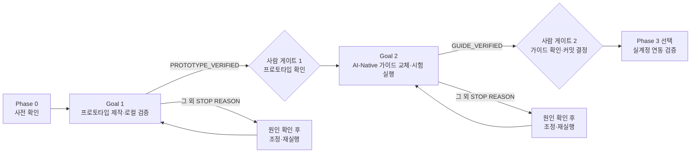

# MAKJI × 카페24 연동 실습 — 작업 계획

프로토타입을 먼저 만들어 로컬에서 검증하고, 그 프로토타입을 기준으로 교육 가이드를 AI-Native형으로 교체한다.
실행은 `/goal` 프롬프트 두 개로 나누어 순서대로 진행한다(프롬프트 원문은 별도 파일로 보관).

- 작성일: 2026-09-14
- 대상 저장소: `sesac-4th-corp-rfp` (MAKJI 브레드마켓 1주차 제안 발표 덱)
- 예제 몰 정보: [`docs/example-mall-info.md`](example-mall-info.md)

---

## 1. 배경과 목적

| 구분 | 내용 |
|---|---|
| 지금 가이드 | `docs/guides/MAKJI_Cafe24_MVP_교육가이드.html` v2 — 57쪽, 예제 몰 wildmental 기준. 학습자가 코드 40개 파일을 **복사·붙여넣기**하는 방식 |
| 바꾸려는 방향 | **AI-Native 실습** — 가이드는 만들 파일 이름과 담길 내용(재료), 에이전트 프롬프트, 수락 기준만 제시. 사람은 웹 계정·온보딩·대시보드 설정과 비밀값 입력만 직접 |
| 프로토타입을 먼저 만드는 이유 | ① 학습자가 만들 결과물을 화면으로 보여줄 기준 ② 에이전트가 프롬프트로 만든 결과를 대조할 정답지 ③ 가이드 프롬프트가 실제로 동작하는지 시험 실행으로 검증하는 근거 |

---

## 2. 현재 상태 (계획 시작 시점)

| 항목 | 상태 |
|---|---|
| 저장소 디렉터리 정리 (`assets/`·`docs/`·`references/`) | 완료, **스테이징됨 · 미커밋** |
| 가이드 v2 (붙여넣기형, 57쪽) + README 갱신 | 완료, **스테이징됨 · 미커밋** |
| v2 코드 검증 | 새 프로젝트에서 가이드 텍스트만으로 `npm test` 25개 통과 · build · lint 통과, 로컬 런타임 점검 18항목, 실제 상품 페이지 사본에서 위젯 표시 확인 |
| v2 미검증 | 실제 카페24 OAuth·상품 16 수정·Scripttags 설치, 실제 Supabase·Vercel 동작 |
| AI-Native 가이드 전환 | 착수 직후 중단 → 이 계획으로 대체 |
| 임시 작업 폴더 `.guide-build/` | 남아 있음(`source.html`, `guide/lib.py`). `.git/info/exclude`에 등록되어 git에 잡히지 않음. Goal 2 시작 시 비움 |
| `docs/example-mall-info.md` | 사용자 추가 파일, 미추적 상태 유지 |

---

## 3. 확정된 결정

| # | 결정 | 선택 |
|---|---|---|
| D1 | 프로토타입 범위 | **B안** — 카페24 연동 레퍼런스 + MVP 체험 일부(일일 UP/DOWN 예측·결과 화면, 목업 데이터) |
| D2 | 프로토타입 위치 | 이 저장소 하위 `prototype/wild-bread-market/`, **중첩(nested) git 저장소**. 상위 `.gitignore`에서 제외 |
| D3 | 자율 루프의 검증 범위 | **로컬 검증까지만** — 실제 카페24·Supabase·Vercel 연결은 사람이 별도 진행 |
| D4 | 가이드 산출 방식 | **기존 가이드 파일 교체** (`docs/guides/MAKJI_Cafe24_MVP_교육가이드.html`) |
| D5 | 실행 방식 | `/goal` 두 개로 분리, Goal 1이 `PROTOTYPE_VERIFIED`로 끝난 뒤 Goal 2 실행 |
| D6 | goal 평가자 | **`aztks-agent`(MODE: EVALUATE)** — 매 turn 끝에 호출해 AZTKS 5차원 등급표와 `AZTKS VERDICT: GO/NO-GO`를 대화에 남김. 완료는 검증 명령 재실행 후 GO일 때만 인정 |

---

## 4. 전체 흐름

| 단계 | 누가 | 결과 |
|---|---|---|
| Phase 0 사전 확인 | 사람 | 실행 환경 준비, goal 프롬프트 파일 저장 |
| Goal 1 | AI 루프 | `prototype/wild-bread-market/` 완성, 로컬 검증 통과 |
| 사람 게이트 1 | 사람 | 화면·결정 로그·사람 할 일 목록 검토 |
| Goal 2 | AI 루프 | AI-Native 가이드로 교체, 프롬프트 시험 실행 통과 |
| 사람 게이트 2 | 사람 | 가이드 검토, 상위 저장소 커밋 여부 결정 |
| Phase 3 (선택) | 사람 + AI | 실제 카페24·Supabase·Vercel로 연동 확인, 가이드 "검증 범위" 갱신 |

---

## 5. Phase 0 — 사전 확인 (사람)

- [ ] Node.js 24, npm, Google Chrome 설치 확인 (`node --version` → `v24.`)
- [ ] Goal 1·Goal 2 프롬프트를 각각 별도 파일로 저장
- [ ] 스테이징된 변경(디렉터리 정리·가이드 v2)을 **먼저 커밋할지** 결정
  - 커밋해 두면 Goal 2가 가이드를 교체해도 v2가 커밋 이력에 남는다.
  - 커밋하지 않으면 v2는 스테이징 영역에만 남는다(Goal 2는 스테이징 상태를 바꾸지 않도록 되어 있음).
- [ ] 두 goal 모두 상위 저장소에 커밋·push·배포하지 않는다는 점 확인

---

## 6. Goal 1 — 프로토타입 제작 (AI 루프)

### 목표

`prototype/wild-bread-market/`에서 `npm test`·`npm run build`·`npm run lint`가 exit 0이고
`node scripts/smoke.mjs`가 `SMOKE: n/n PASS`를 출력하는 상태.

### 만드는 것

| 영역 | 내용 |
|---|---|
| 연동 레퍼런스 | 가이드 v2의 40개 파일을 출발점으로: `/admin/cafe24` 관리 화면, OAuth 시작·콜백, 상품 16 조회·기준값·미리보기·적용·복원, Scripttags 설치, 공개 위젯 API, 상품 상세 위젯 JS, Supabase SQL. **라우트·응답 JSON·오류 코드·테이블 이름은 v2와 동일 유지** |
| MVP 체험 목업 | `/` 랜딩(3종 지수 카드·이번 주 챌린지 안내), `/predict` 일일 UP/DOWN 예측(마감 카운트다운·제출·수정), `/result` 결과(지수별 정답·오답·주간 정확도·월~금 진행 표시) |
| 목업 로직 | 마감 판정, 정답 판정, 주간 정확도(정답 수 ÷ 유효 예측 수, 무효 회차 제외) — 순수 함수 + 테스트 |
| 점검 스크립트 | `scripts/smoke.mjs` — 프로덕션 빌드 + 가짜 Supabase로 관리 API 보호·OAuth 분기·CORS·화면 응답·위젯 표시 점검. `--project <경로>`로 다른 프로젝트도 점검 가능 |
| 기록 | `docs/DECISION_LOG.md`(CORE/MINOR 카운터), `docs/HUMAN_TODO.md`(사람이 할 웹 작업 목록) |

화면 기준 자료: `references/mobile-screens/U01~U06`, `references/ux-intro-slides/01~02`, `index.html` 3~6장.
지수 값: 통밀 102.4 ▲1.2% · 크루아상 98.7 ▼0.5% · 골든 105.1 ▲0.8%.

### 고정 버전

Next.js 16.3.5 · react 19.2.8 · @supabase/supabase-js 2.116.0 · @supabase/ssr 0.12.7 · server-only 0.0.1 ·
@types/node 24.13.4 · vitest 5.0.0 · @electric-sql/pglite 0.5.8 · Node.js 24

### 종료 코드와 대응

| STOP REASON | 의미 | 사람의 대응 |
|---|---|---|
| `PROTOTYPE_VERIFIED` | 완료 | 사람 게이트 1로 진행 |
| `CORE_BUDGET` | 큰 결정 3건 누적 | `DECISION_LOG.md`의 CORE 항목 검토 → 확정 사항을 반영해 재실행 |
| `MINOR_BUDGET` | 작은 결정 12건 누적 | MINOR 항목 일괄 승인 또는 기준 제시 후 재실행 |
| `SMOKE_STUCK` | 같은 점검 항목 3회 연속 실패 | 실패 항목과 로그 확인 → 계약 조정 여부 결정 |
| `EVAL_STUCK` | `aztks-agent`가 같은 `NEXT FIX`로 NO-GO 3회 연속 | 마지막 등급표의 ✕·△ 근거 확인 → 기준을 조정할지, 수정 방향을 지시할지 결정 |
| `TURN_CAP` | 40 turns(= 평가 40회) 도달 | 진행 상황 확인 후 남은 범위로 재실행 |

---

## 7. 사람 게이트 1 — 프로토타입 확인

- [ ] `cd prototype/wild-bread-market && npm run dev` → `/`, `/predict`, `/result` 화면이 발표자료 흐름과 맞는지 확인
- [ ] `docs/DECISION_LOG.md`의 CORE 결정 검토
- [ ] `docs/HUMAN_TODO.md`가 실제 필요한 웹 작업(카페24 개발자센터·쇼핑몰 관리자, Supabase, Vercel, GitHub)을 빠짐없이 담았는지 확인
- [ ] 상위 저장소 `git status`에 `.gitignore` 한 줄 외 변경이 없는지 확인

---

## 8. Goal 2 — AI-Native 가이드 교체 (AI 루프)

### 목표

가이드를 AI-Native형으로 교체하고, 가이드의 🤖 프롬프트만으로 새 폴더에서 만든 프로젝트가
test·build·lint exit 0과 `SMOKE: n/n PASS`를 통과하는 상태.

### 가이드 작성 원칙

| 원칙 | 내용 |
|---|---|
| 코드 단계 구성 | **만들어질 파일명 + 담길 내용(재료)** → **에이전트 프롬프트** → **수락 기준** → **막히면** |
| 공통 재료 | 에이전트가 만드는 `docs/lab-context.md`(몰 값·지수·문구·가격 규칙·카페24 API 사실·환경변수 이름·고정 버전)와 `AGENTS.md` 실습 규칙 |
| 역할 표시 | 🤖 에이전트 · 🧑 직접·웹 설정 · 👀 직접·확인 · 🔑 직접·비밀값 |
| 사람 작업 한정 | 계정 가입·온보딩·대시보드 설정(카페24 개발자센터·쇼핑몰 관리자, Supabase, Vercel, GitHub 웹), 비밀값 입력, 결과 눈으로 확인 |
| 코드 전문 금지 | 앱 소스 전문을 싣지 않음(짧은 명령·확인 SQL·응답 예시는 허용) |
| 비밀값 | 가이드·프롬프트·에이전트 대화에 비밀값을 쓰지 않음 |
| 유지 요소 | 단일 HTML, 내장 폰트 124개 + OFL 라이선스, 목차·검색·방향키·완료 체크·전체 읽기·인쇄, 내 앱 주소 치환, 예제 몰 사실·공식 문서 확인 내용, "검증 범위" 페이지 |

### 역할 배정 기준

| 작업 | 담당 |
|---|---|
| 프로젝트 생성, 패키지 설치, 코드·테스트·SQL 파일 작성, 테스트·빌드 실행, curl 점검, git 커밋·push | 🤖 에이전트 |
| 공개 상품 페이지에서 번호 확인 | 🤖 에이전트(페이지 조회) + 👀 사람(콘솔 확인 선택) |
| 카페24 개발자센터 가입·앱 등록·권한·테스트 실행, 쇼핑몰 관리자 원래 값 확인·앱 삭제 | 🧑 사람 |
| Supabase 프로젝트 생성·SQL Editor 실행·관리자 계정·키 확인 | 🧑 사람 |
| GitHub 저장소 생성, Vercel 가져오기·환경변수·재배포 | 🧑 사람 |
| 토큰 암호화 키 생성, `.env.local`·Vercel 비밀값 입력 | 🔑 사람 |
| 관리 화면 버튼 실행, 상품 페이지·위젯 확인 | 👀 사람 |

### 검증 방법

1. **시험 실행**: `.guide-build/agent-run/`에서 서브에이전트가 가이드의 🤖 프롬프트만 순서대로 실행(프로토타입·가이드 원본은 읽지 않음, 🧑·🔑 단계는 가짜 값으로 대체).
2. **대조 점검**: 결과 프로젝트에 `smoke.mjs --project` 실행 → `SMOKE: n/n PASS`.
3. **가이드 점검**: `scripts/guide-check.mjs` → `GUIDE_CHECK: slides=N errors=0 overflow=0 prompts=P fullcode=0 appOrigin=OK`.
4. 실패하면 프롬프트·수락 기준을 보완해 다시 시험 실행(최대 3라운드).
5. **평가**: 매 turn 끝에 `aztks-agent`가 위 결과와 가이드 작성 원칙을 AZTKS 5차원으로 채점하고 GO/NO-GO를 판정. 시험 실행 서브에이전트와 평가자는 분리한다.

### goal 평가자 판정 규칙 (Goal 1·2 공통)

| 항목 | 내용 |
|---|---|
| 호출 | 매 turn 끝 1회 + 완료 주장 직전 최종 판정 1회 |
| 권한 | 읽기 전용(파일 수정·커밋·설치 금지). 검증 명령 재실행만 허용 |
| GO 조건 | ① 검증 명령 기준 모두 충족 ② 4) 제약 위반 0건 ③ 5차원 중 ✕ 0개 — 셋 다 만족할 때만 GO |
| 출력 | 5차원 등급표 · `AZTKS VERDICT: GO\|NO-GO` · NO-GO면 `NEXT FIX` 1개 |
| 기록 | 종료 시 결정 로그에 `STOP REASON`과 `AZTKS VERDICT` 두 줄 |

### 종료 코드와 대응

| STOP REASON | 의미 | 사람의 대응 |
|---|---|---|
| `GUIDE_VERIFIED` | 완료 | 사람 게이트 2로 진행 |
| `PREREQ_MISSING` | Goal 1 미완료 | Goal 1부터 실행 |
| `DRYRUN_FAIL_CAP` | 시험 실행 3라운드 실패 | 실패 단계의 프롬프트·계약 검토 → 방향 조정 후 재실행 |
| `EVAL_STUCK` | `aztks-agent`가 같은 `NEXT FIX`로 NO-GO 3회 연속 | 마지막 등급표 근거 확인 → 기준 조정 또는 수정 방향 지시 후 재실행 |
| `CORE_BUDGET` / `MINOR_BUDGET` | 결정 누적 | `GUIDE_DECISION_LOG.md` 검토 후 재실행 |
| `TURN_CAP` | 40 turns(= 평가 40회) 도달 | 진행 상황 확인 후 재실행 |

---

## 9. 사람 게이트 2 — 가이드 확인과 커밋

- [ ] 가이드를 브라우저로 열어 시작 → 2장(프롬프트 단계) → 6장(실습) 흐름을 훑어보기
- [ ] "검증 범위" 페이지가 시험 실행 결과와 미검증 항목을 사실대로 적었는지 확인
- [ ] 상위 저장소 `git status`의 변경이 가이드 HTML·`README.md`·`.gitignore`뿐인지 확인
- [ ] 상위 저장소 커밋 요청(필요 시 GitHub Pages 배포 확인)
- [ ] 프로토타입 중첩 저장소를 원격(GitHub)에 올릴지 결정

---

## 10. Phase 3 (선택) — 실계정 연동 검증

`prototype/wild-bread-market/docs/HUMAN_TODO.md` 순서로 진행한다.

1. 🧑 Supabase 프로젝트 생성, SQL 실행, 관리자 계정 생성
2. 🧑 GitHub 저장소 생성 → Vercel 가져오기, 🔑 환경변수 입력
3. 🧑 카페24 개발자센터 앱 등록(App URL·Redirect URI·권한·버전), 🔑 Client ID/Secret 입력
4. 👀 테스트 실행으로 wildmental에 설치 → 연결 → 상품 16 조회·적용(4,940원)·복원(5,200원) → 위젯 설치·확인
5. 🤖 결과를 바탕으로 가이드의 응답 예시를 실제 캡처로 바꾸고 "검증 범위" 갱신
6. 👀 실습 종료 정리: 복원, 위젯 삭제, 쇼핑몰 관리자 앱 → 마이앱에서 테스트 앱 삭제, 토큰 행 삭제

---

## 11. 산출물 목록

| 경로 | 만드는 단계 | git |
|---|---|---|
| `prototype/wild-bread-market/` (앱 코드·테스트·SQL) | Goal 1 | 중첩 저장소 |
| `prototype/wild-bread-market/scripts/smoke.mjs`, `scripts/fixtures/` | Goal 1 | 중첩 저장소 |
| `prototype/wild-bread-market/docs/DECISION_LOG.md`, `HUMAN_TODO.md` | Goal 1 | 중첩 저장소 |
| `prototype/wild-bread-market/scripts/guide-check.mjs` | Goal 2 | 중첩 저장소 |
| `prototype/wild-bread-market/docs/GUIDE_DECISION_LOG.md` | Goal 2 | 중첩 저장소 |
| `.gitignore` (`prototype/wild-bread-market/` 한 줄) | Goal 1 | 상위 저장소 |
| `docs/guides/MAKJI_Cafe24_MVP_교육가이드.html` (AI-Native판) | Goal 2 | 상위 저장소 |
| `README.md` 가이드 설명 한 줄 | Goal 2 | 상위 저장소 |
| `.guide-build/` (시험 실행 폴더) | Goal 2 | 제외, 완료 후 삭제 |

---

## 12. 공통 제약

- 상위 저장소에 커밋·push하지 않는다. 기존 스테이징 상태를 바꾸지 않는다.
- 수정 금지: `index.html`, `assets/`, `references/`, `docs/DESIGN.md`, `docs/presentation-deck-structure.md`, `docs/example-mall-info.md`
  (Goal 1은 `docs/guides/`도, Goal 2는 프로토타입 앱 코드도 수정 금지).
- 비밀값을 만들거나 요청·출력하지 않는다.
- `wildmental.cafe24api.com`에 인증 요청을 보내지 않는다(공개 상품 페이지 조회만 허용).
- Vercel 배포와 원격 서비스 상태 변경을 하지 않는다.

---

## 13. 위험과 가정

| 위험·가정 | 영향 | 대응 |
|---|---|---|
| 에이전트 출력은 실행마다 다름 | 같은 프롬프트로도 결과가 달라질 수 있음 | 프롬프트에 계약(경로·JSON·오류 코드)과 테스트 사례를 명시하고 smoke로 대조 |
| 시험 실행 에이전트가 Claude 계열 하나 | 다른 도구(Cursor·Codex 등)에서는 결과가 다를 수 있음 | "검증 범위"에 실행 도구를 명시 |
| 실계정 동작 미검증 | 카페24 권한·스킨·가격 계산 기준 설정에 따라 실제 응답이 다를 수 있음 | Phase 3에서 확인 후 가이드 갱신 |
| 상품 16 ↔ 통밀 브레드 지수 매칭 | 발표자료 Q2(지수별 대표 상품) 미확정 상태의 실습 가정 | 가이드와 결정 로그에 가정으로 표기, 확정 시 교체 |
| 중첩 저장소 | 상위 저장소에서 프로토타입 이력이 보이지 않음 | 필요하면 사람 게이트 2에서 원격 저장소 연결 결정 |
| 카페24·Supabase·Vercel 화면 개편 | 가이드의 메뉴 이름이 달라질 수 있음 | 공식 문서 경로 기준으로 쓰고 "메뉴 이름이 다를 때" 안내 유지 |
